# AI Data Analyst

AI Data Analyst 是一个面向复杂业务数仓场景的智能分析助手，基于 AI Agent 技术实现 Schema 理解、表关联推理、SQL 生成与自修复、深度分析、飞书结果发布等能力。

## 项目亮点

- **Schema 理解**：自动读取表结构、字段类型、业务表关系和元数据
- **表关联推理**：基于字段语义和时间维度推理多表关联路径
- **SQL 生成与自修复**：支持复杂 SQL 生成、错误检测与自动修复重试
- **深度分析**：对查询结果做趋势、对比、统计和业务洞察提炼
- **证据驱动分析**：数据库证据不足时可切换到知识库/文档分析
- **飞书集成**：支持多维表格同步、文档生成和群消息发布
- **前端演示模式**：支持前端快照数据源，方便比赛展示和离线演示

## 目录结构

- `backend/`：后端服务，包含智能分析链路、数据库探索、飞书接入等能力
- `frontend/`：前端应用，保留对话、流程展示、数据库和飞书接入页面
- `docker-compose.yml`：独立版 Docker 编排

## 环境要求

- Node.js 18+
- Python 3.10+
- Docker + Docker Compose

## 快速开始

### 方式 A：两终端启动（推荐开发调试）

#### 终端 1：启动后端和依赖服务

```bash
cd ./
./start-backend.sh
```

后端默认运行在 `http://127.0.0.1:8000`。

#### 终端 2：启动前端

```bash
cd ./frontend
npm install
npm run dev
```

前端默认运行在 `http://localhost:5173`。

### 方式 B：一键启动完整 Docker 栈

```bash
cd ./
./start.sh start
```

启动后会自动拉起：
- PostgreSQL: `localhost:5433`
- Redis: `localhost:6380`
- Milvus: `localhost:19531`
- Elasticsearch: `localhost:1201`
- 后端 API: `http://localhost:8001`

## 演示截图

下面展示 AI Data Analyst 的核心页面和演示结果，方便快速了解项目效果。

### 首页
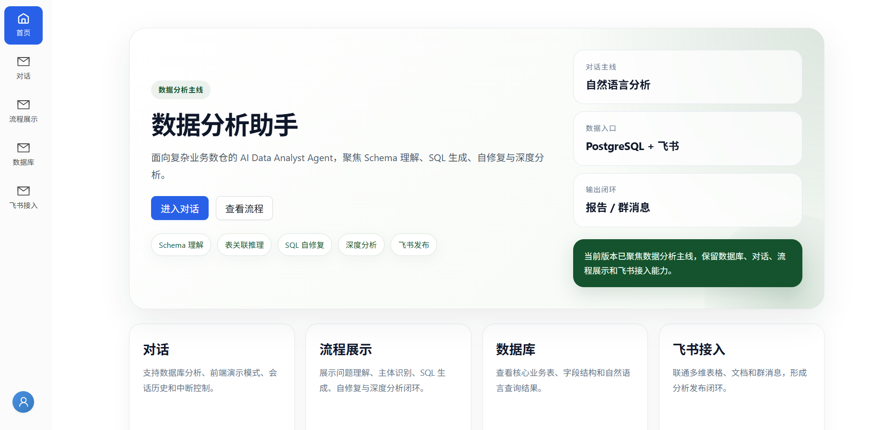

### 对话页
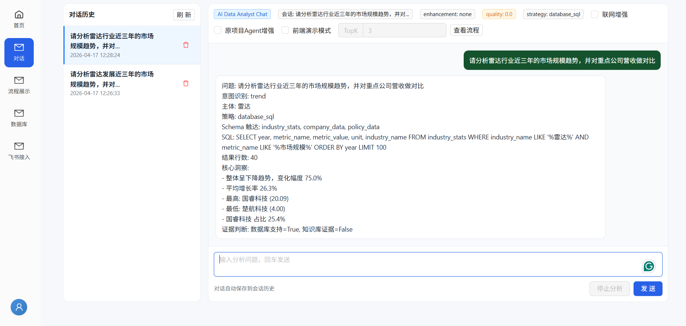

### 流程页
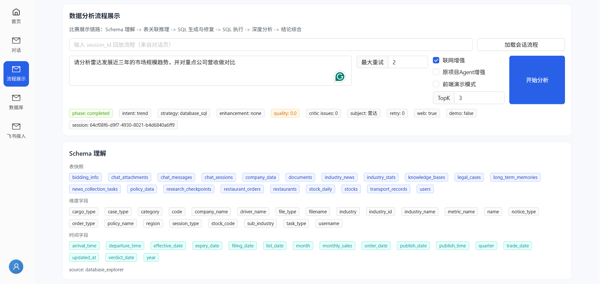

### 数据集
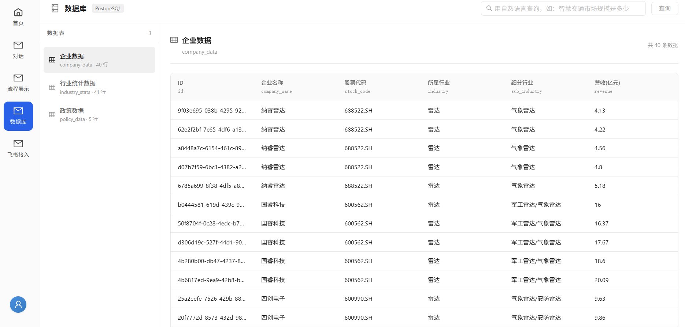

### 流程日志
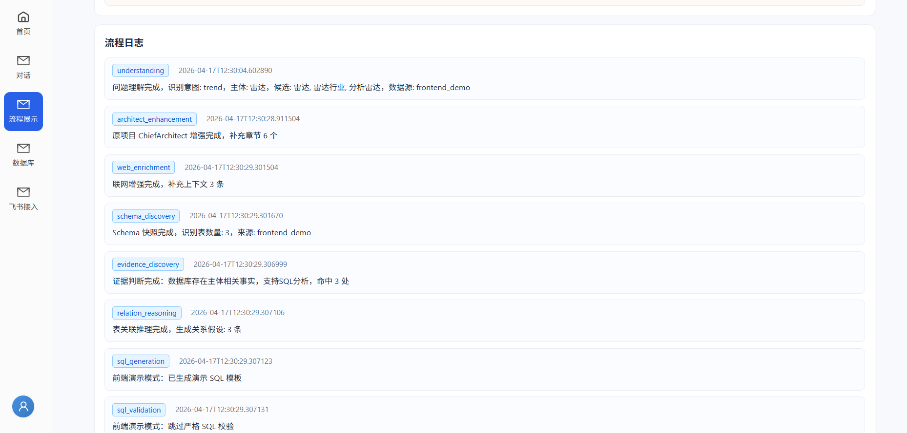
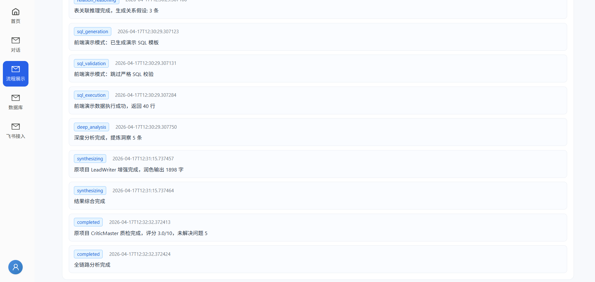

### 分析结果
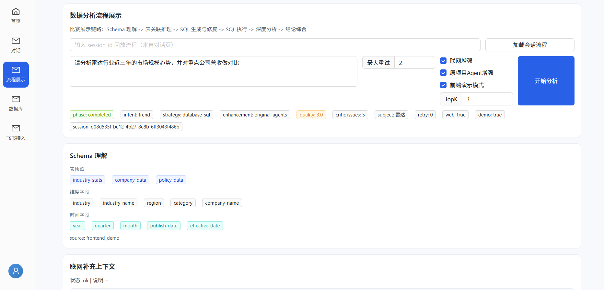
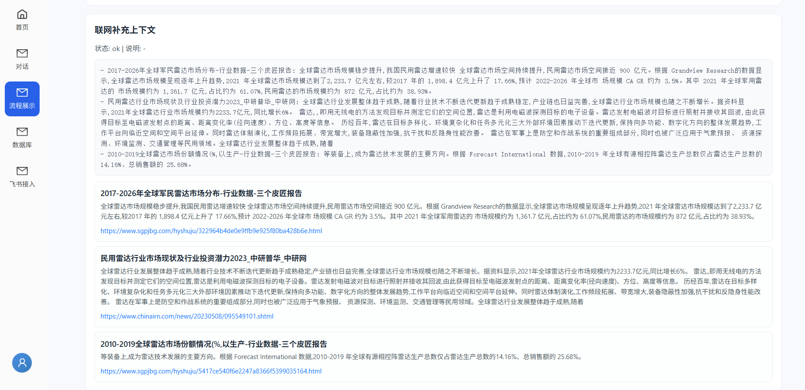
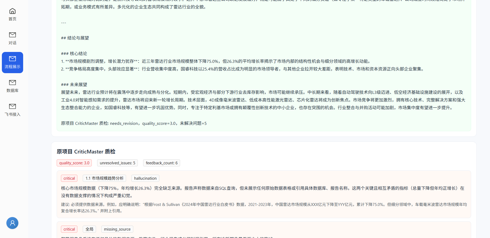
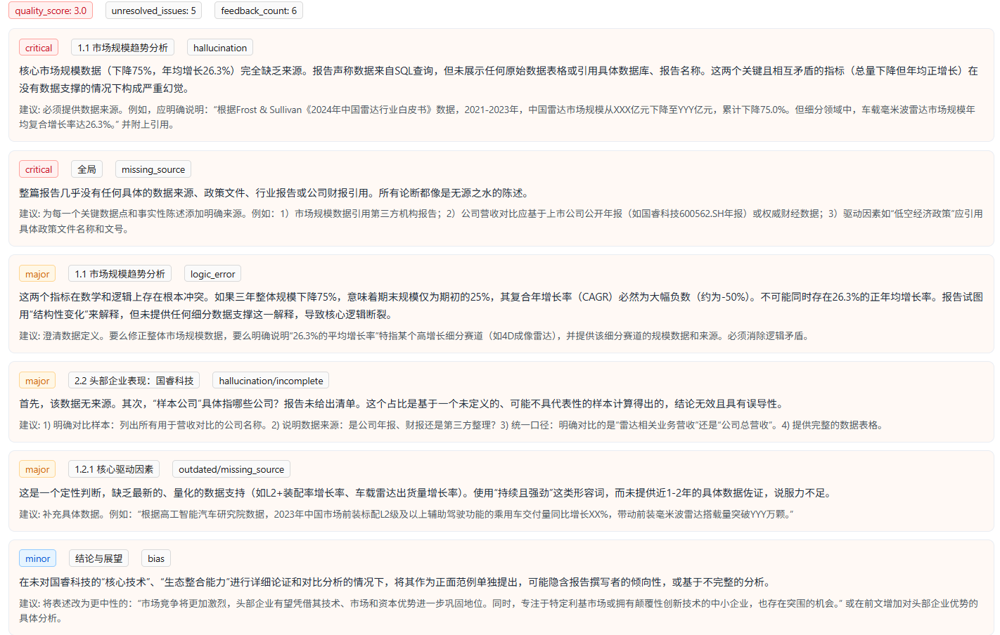
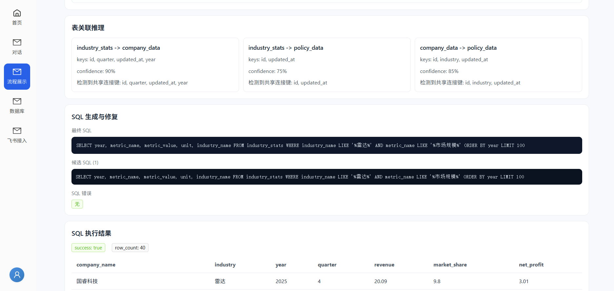
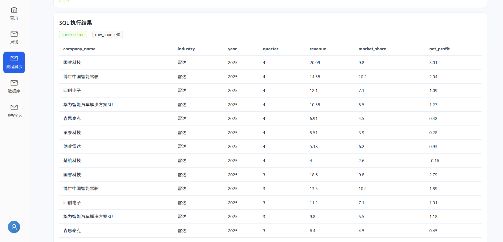
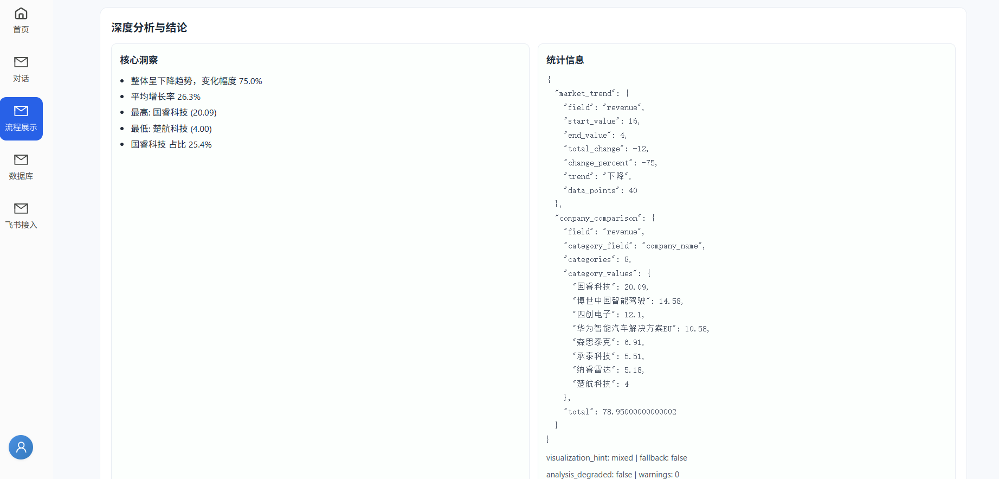
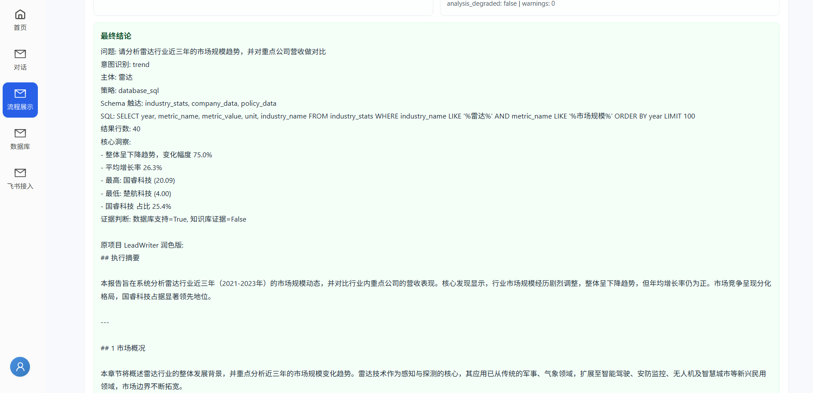

### 飞书接入
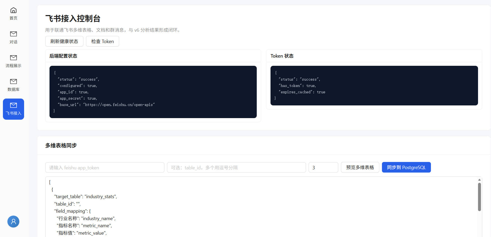
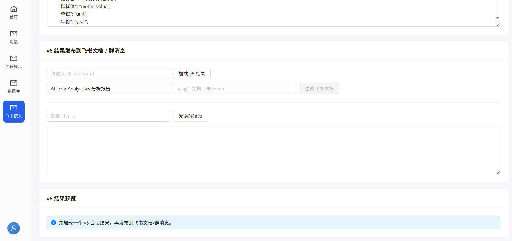

## 数据初始化

如果你想加载比赛演示数据，可以在启动数据库后执行：

```bash
cd ./backend/app
POSTGRES_HOST=localhost POSTGRES_PORT=5433 POSTGRES_USER=postgres POSTGRES_PASSWORD=postgres123 POSTGRES_DB=industry_assistant python3 scripts/seed_radar_demo_data.py
```

也可以选择其他脚本：

```bash
python3 scripts/init_industry_data.py
python3 scripts/seed_industry_data.py
```

## 常用命令

### 启动后端依赖和服务

```bash
./start-backend.sh
```

### 启动前端

```bash
./start-frontend.sh
```

### 启动完整 Docker 栈

```bash
./start.sh start
```

### 停止 Docker 栈

```bash
./start.sh stop
```

### 查看状态

```bash
./start.sh status
```

### 查看日志

```bash
./start.sh logs
```

## 主要页面

- `/`：首页
- 对话页
- 流程展示页
- `/database`：数据库页
- `/feishu`：飞书接入页

## 环境变量

后端常用环境变量包括：

- `DASHSCOPE_API_KEY`
- `BOCHA_API_KEY`
- `DOCMIND_ACCESS_KEY_ID`
- `DOCMIND_ACCESS_KEY_SECRET`
- `FEISHU_APP_ID`
- `FEISHU_APP_SECRET`
- `FEISHU_BITABLE_APP_TOKEN`
- `FEISHU_DEFAULT_CHAT_ID`

前端常用环境变量见 `frontend/.env.example`：

- `VITE_TITLE`
- `VITE_API_BASE`
- `VITE_API_PROXY`

